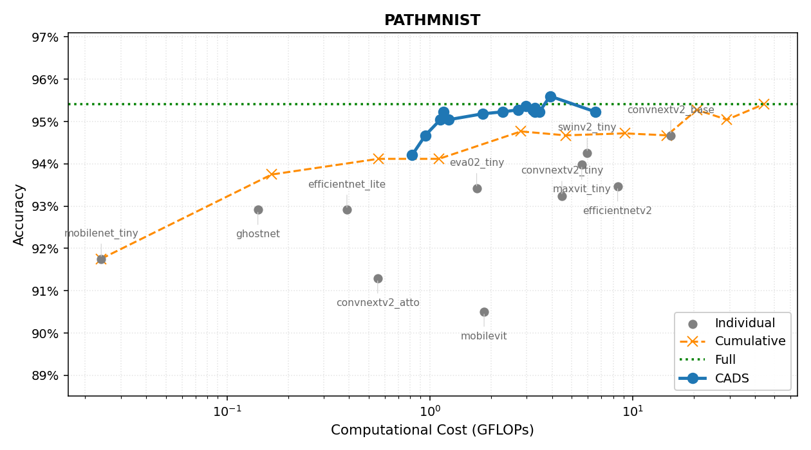
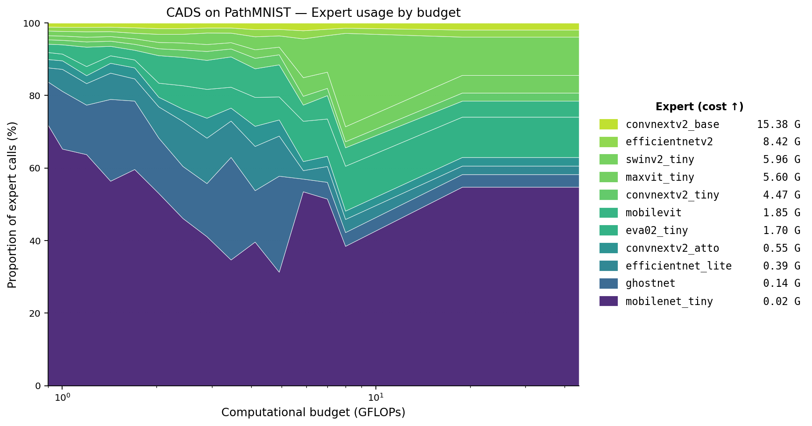
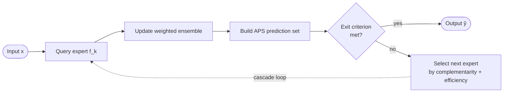

<div align="center">

# CADS

### Conformal Adaptive Decision System for Cost-Efficient Image Classification

[](https://arxiv.org/abs/2605.16401)
[](#citation)
[](https://www.python.org/downloads/)
[](LICENSE)


**Reference implementation** of CADS — a cost-aware multi-expert cascade for
image classification with conformal-prediction-based exit decisions.

</div>

> Mikael Turkoglu, Tim Bary, Vincent Thielens, Manon Dausort, Benoît Macq.
> *CADS: Conformal Adaptive Decision System for Cost-Efficient Image
> Classification.* IEEE International Conference on Image Processing
> (ICIP), 2026.

CADS sequentially queries pre-trained experts ordered by computational cost,
constructs an Adaptive Prediction Set (APS) at each step, and halts as soon
as a conformal exit criterion is met. The next expert at each step is
chosen by a complementarity-weighted score that prefers experts known to
correct the current expert's failure modes.

<div align="center">



*On PathMNIST, CADS reaches the full-ensemble accuracy of ~95.5 % at ~3.5 GFLOPs vs ~44 GFLOPs for the static full ensemble — a **~12× reduction** at constant accuracy.*



*How CADS achieves it: at low budgets the cascade is dominated by sub-GFLOP experts (dark, bottom of stack); the share of heavier experts (light, top of stack) grows smoothly as the budget allows.*

</div>

---

## Table of contents

- [Quick start](#quick-start)
- [How CADS works](#how-cads-works)
- [Use CADS with your own models](#use-cads-with-your-own-models)
- [Repository layout](#repository-layout)
- [CLI reference](#cli-reference)
- [Expert prediction cache](#expert-prediction-cache)
- [Data splits](#data-splits)
- [Output schema](#output-schema)
- [Development](#development)
- [Reproducing the paper](#reproducing-the-paper)
- [Citation](#citation)
- [License & Contact](#license)

---

## Quick start

The repository ships with the eleven PathMNIST expert prediction caches
used in the paper, so the demo runs out of the box without training any
model.

```bash
git clone <repo-url>
cd cads_release
pip install -r requirements.txt
python scripts/demo_pathmnist.py --n_trials 200 --parallel
```

**Expected runtime:** ~1 minute on a recent laptop with `--parallel`.

**Output:** two figures in `demo_outputs/figures/` and a JSON summary
in `demo_outputs/pathmnist_summary.json`.

A fully synthetic demo (`scripts/demo.py`) is also provided for users
who want to verify the installation without using the PathMNIST caches:

```bash
python scripts/demo.py --n_trials 80
```

---

## How CADS works

Given a pool of pre-trained classifiers `f_1, ..., f_K` with FLOPs costs
`g_1 ≤ ... ≤ g_K`, CADS chooses, for each input `x`, a subset of experts
to consult so as to maximize accuracy under a per-sample expected FLOPs
budget `B`.



*CADS inference pipeline. The dashed arrow is the cascade loop: if the
conformal exit condition is not met, the next expert is selected via
the complementarity-efficiency trade-off and queried in turn.*

The cascade is driven by three coupled mechanisms:

1. **Conformal exit.** A class-conditional APS prediction set `C(x)` is
   built from the current weighted ensemble. The cardinality `|C(x)|`
   categorizes the sample (singleton / binary / difficult) and sets a
   base confidence threshold. The cascade exits as soon as the ensemble
   confidence exceeds the threshold and the two most recent experts
   agree.
2. **Complementarity-driven routing.** The next expert is selected by
   `Score(A, B) = w · Comp(A, B) + (1 − w) · eff(B)`, where `Comp(A, B)`
   is the empirical probability that `B` is correct when `A` is wrong,
   and `eff(B)` is the cost-normalized accuracy of `B`. Complementarity
   is estimated at three levels of granularity (global, per predicted
   class, per confused class pair).
3. **Two-level weighted ensemble.** Per-expert weights combine a global
   term `acc^γ` and a class-local term that emphasizes experts strong on
   the current consensus class.

Hyperparameters are optimized with Optuna (TPE) under a soft FLOPs
penalty. See Section 3 of the paper for the full formulation.

---

## Use CADS with your own models

CADS is a **post-training** orchestration layer — it does **not** train
neural networks. To run CADS on your own data and models, you provide
softmax predictions and CADS does the rest. Here is the end-to-end path.

### 1. Prerequisites

You need three things:

1. A **classification dataset** with a clear train / test split (a
   validation split is recommended for training the experts but is not
   used by CADS itself).
2. A **pool of pre-trained classifiers** — typically three or more — of
   varying computational cost, all trained on the same dataset and all
   evaluated on the same held-out test split. CADS works best when the
   pool spans a wide range of FLOPs (from sub-GFLOP "scouts" to
   multi-GFLOP "oracles").
3. The **per-expert softmax predictions** on that held-out test split,
   stored as `.npz` files (see [Expert prediction cache](#expert-prediction-cache)).

CADS is architecture-agnostic — PyTorch, TensorFlow, JAX, anything that
produces a softmax over a fixed set of classes works.

### 2. Pipeline at a glance

```
[raw dataset]
   │
   │  Split into train / val / test (use the dataset's native
   │  split when available, e.g. MedMNIST v2)
   ▼
[train set]  [val set]  [test set]
   │            │           │
   │ Train (or fine-tune) each expert in your pool on the
   │ train set, using the val set for early stopping
   ▼
[trained experts E_1, ..., E_K]
   │
   │ For each expert, run inference on the TEST set with
   │ shuffle=False, save (probs, labels) as one .npz per expert
   ▼
[cache/<dataset>/<dataset>_<expert>_predictions.npz × K]
   │
   │ Run scripts/run_cads.py, which splits the cache stratified
   │ per class into D_opt / D_cal / D_test, performs TPE search
   │ on D_opt, recalibrates conformal quantile on D_cal,
   │ evaluates on D_test
   ▼
[per-budget accuracy / GFLOPs / exit-distribution curve]
```

The first three phases are **external** to this repository — you train
your own experts and dump their predictions. The final phase is what
`scripts/run_cads.py` does.

### 3. Register your dataset and experts

Both are one-line edits in [`cads/config.py`](cads/config.py).

**Add a dataset:**

```python
DATASET_CONFIGS['my_dataset'] = {
    'n_classes':   7,
    'description': 'My custom 7-class problem',
}
```

**Add an expert:**

```python
EXPERT_GFLOPS['my_model'] = 2.3   # FLOPs in giga, native input resolution
```

The GFLOPs value is only used for cost accounting and budget
enforcement, so any standard profiler at the model's native input
resolution will do. Quick measurement with [`fvcore`](https://github.com/facebookresearch/fvcore):

```python
import torch
from fvcore.nn import FlopCountAnalysis

dummy = torch.randn(1, 3, 224, 224)   # match the model's native input shape
gflops = FlopCountAnalysis(model.eval(), dummy).total() / 1e9
print(f"{gflops:.3f} GFLOPs")
```

Equivalent calls work with [`thop`](https://github.com/Lyken17/pytorch-OpCounter)
(`profile(model, (dummy,))`) or [`ptflops`](https://github.com/sovrasov/flops-counter.pytorch)
(`get_model_complexity_info(model, (3, 224, 224))`).

### 4. Generate the prediction caches

For each expert, run inference on the test set with `shuffle=False` and
save `(probs, labels)` to one `.npz` per expert. A reference PyTorch
snippet:

```python
import numpy as np
import torch
from torch.utils.data import DataLoader

model.eval()
all_probs, all_labels = [], []

with torch.no_grad():
    for images, labels in DataLoader(test_set, batch_size=128, shuffle=False):
        probs = torch.softmax(model(images.to(device)), dim=1).cpu().numpy()
        all_probs.append(probs)
        all_labels.append(labels.numpy())

probs  = np.concatenate(all_probs,  axis=0).astype(np.float32)
labels = np.concatenate(all_labels, axis=0).astype(np.int64)

np.savez(
    "cache/my_dataset/my_dataset_my_model_predictions.npz",
    probs=probs, labels=labels,
)
```

> **Important.** `shuffle=False` is **mandatory**. The sample order of
> the test set must be identical across every expert's cache, otherwise
> the stratified split will pair predictions from different samples.

A complete reference implementation lives in
[`scripts/generate_cache.py`](scripts/generate_cache.py) — including a
`save_prediction_cache()` helper that validates dtype, shape, row-sum
and label range before writing the file.

### 5. Validate each cache

Before running CADS, sanity-check every `.npz` you just generated:

```bash
python scripts/generate_cache.py cache/my_dataset/my_dataset_my_model_predictions.npz
```

The script prints the shape, dtype, row-sum range, label range, and the
single-expert accuracy. Expected output:

```
Keys: ['probs', 'labels']
probs     : shape=(N, n_classes)  dtype=float32
labels    : shape=(N,)            dtype=int64
row sums  : min≈1.000000          max≈1.000000
label range: [0, n_classes - 1]
accuracy  : XX.XX%
```

Two things to double-check across all your caches: **N is identical**
(same number of test samples) and **the single-expert accuracy is
plausible** (no NaN, no near-zero from a forgotten softmax or a wrong
class order).

### 6. Run CADS

```bash
export CADS_CACHE_PATH=./cache
python scripts/run_cads.py --dataset my_dataset --n_trials 200 --parallel
```

CADS performs the three-way stratified split internally, runs TPE
optimization across an adaptive grid of FLOPs budgets, and writes a
JSON + CSV file to `results/` containing the accuracy–cost curve,
baselines, and per-budget exit statistics.

### Datasets registered out of the box

| Dataset       | Classes | Domain                                       |
|---------------|---------|----------------------------------------------|
| `pathmnist`   | 9       | Colorectal histology patches (MedMNIST v2)   |
| `bloodmnist`  | 8       | Blood cell microscopy (MedMNIST v2)          |
| `dermamnist`  | 7       | Dermatoscopy (MedMNIST v2)                   |
| `tissuemnist` | 8       | Kidney tissue microscopy (MedMNIST v2)       |
| `organamnist` | 11      | Abdominal organ CT (MedMNIST v2)             |
| `retinamnist` | 5       | Retinal fundus (MedMNIST v2)                 |
| `cifar10`     | 10      | Natural images, low resolution               |
| `cifar100`    | 100     | Natural images, high cardinality             |

> Only the **PathMNIST** caches are shipped with the repo. For any other
> dataset (registered or custom), you must generate the caches yourself.

### Shipped PathMNIST expert pool

The 11 prediction caches in `cache/pathmnist/` cover the full cost
spectrum used in the paper. Solo accuracies are measured on the full
PathMNIST held-out test split (N = 7180).

| Expert              | Family               | GFLOPs | Solo accuracy |
|---------------------|----------------------|-------:|--------------:|
| `mobilenet_tiny`    | Lightweight CNN      |  0.024 |        91.50% |
| `ghostnet`          | Lightweight CNN      |  0.142 |        92.95% |
| `efficientnet_lite` | Lightweight CNN      |  0.390 |        92.70% |
| `convnextv2_atto`   | Mid-range CNN        |  0.553 |        91.16% |
| `eva02_tiny`        | Vision Transformer   |  1.700 |        93.66% |
| `mobilevit`         | Hybrid CNN/ViT       |  1.850 |        90.58% |
| `convnextv2_tiny`   | Mid-range CNN        |  4.470 |        93.12% |
| `maxvit_tiny`       | Vision Transformer   |  5.600 |        94.40% |
| `swinv2_tiny`       | Vision Transformer   |  5.960 |        94.60% |
| `efficientnetv2`    | Mid-range CNN        |  8.420 |        93.59% |
| `convnextv2_base`   | Large CNN            | 15.380 |        94.93% |

---

## Repository layout

```
cads_release/
├── README.md               This file
├── ARCHITECTURE.md         Code tour: modules, data flow, key abstractions
├── LICENSE                 MIT license
├── requirements.txt        Runtime dependencies (numpy, optuna, joblib, matplotlib)
├── requirements-dev.txt    Test dependencies (pytest)
├── .gitignore              Standard Python + CADS run-time artefacts
├── cads/                   Python package — core implementation
│   ├── __init__.py         Public API
│   ├── config.py           Registries (DATASET_CONFIGS, EXPERT_GFLOPS), Config
│   ├── data.py             PredictionCache + three-way stratified split
│   ├── profiling.py        Per-expert profiling on D_opt
│   ├── complementarity.py  Empirical complementarity scores
│   ├── conformal.py        Class-conditional APS predictor
│   ├── engine.py           CADSEngine + CADSParams (cascade core)
│   ├── optimization.py     Per-budget Optuna TPE search
│   ├── baselines.py        Individual / cumulative / full-ensemble baselines
│   └── io_utils.py         JSON + CSV serialisation
├── scripts/
│   ├── demo_pathmnist.py   Quick-start demo on the paper's PathMNIST pool
│   ├── demo.py             Synthetic-data demo (no external dependencies)
│   ├── run_cads.py         Main CLI for any registered dataset
│   └── generate_cache.py   Utility to build new .npz caches from your models
├── tests/                  Smoke tests (synthetic data, no caches required)
│   ├── conftest.py         Shared fixtures and import-path setup
│   └── test_smoke.py       Public-API smoke tests
├── .github/workflows/
│   └── ci.yml              GitHub Actions: pytest on Python 3.9 → 3.12
├── cache/
│   └── pathmnist/          11 PathMNIST expert prediction caches (.npz, ≈2.5 MB)
└── demo_outputs/           Sample output of demo_pathmnist.py (figures + JSON)
```

---

## CLI reference

The main entry point is `scripts/run_cads.py`.

### Typical invocations

PathMNIST, default 6-expert pool, adaptive budget grid:

```bash
python scripts/run_cads.py --dataset pathmnist --n_trials 200 --parallel
```

Custom expert pool:

```bash
python scripts/run_cads.py \
    --dataset cifar100 \
    --experts mobilenet_tiny,ghostnet,efficientnet_lite,eva02_tiny,maxvit_tiny,swinv2_tiny \
    --n_trials 300 \
    --parallel
```

Custom budget grid (in GFLOPs):

```bash
python scripts/run_cads.py \
    --dataset pathmnist \
    --budgets 0.1,0.5,1.0,2.0,5.0,10.0 \
    --n_trials 200
```

Reproducible run with a fixed seed and routing-overhead accounting disabled:

```bash
python scripts/run_cads.py \
    --dataset pathmnist \
    --seed 0 \
    --no_overhead \
    --n_trials 200
```

### Flags

| Flag            | Default       | Meaning                                                          |
|-----------------|---------------|------------------------------------------------------------------|
| `--dataset`     | *required*    | One of the keys of `DATASET_CONFIGS`                             |
| `--experts`     | preset of 6   | Comma-separated expert names (must exist in `EXPERT_GFLOPS`)     |
| `--budgets`     | adaptive grid | Comma-separated GFLOPs budgets                                   |
| `--n_trials`    | 200           | TPE trials per budget level                                      |
| `--parallel`    | off           | Parallelize budget levels with joblib                            |
| `--no_overhead` | off           | Disable routing-overhead accounting                              |
| `--val_ratio`   | 0.7           | Fraction of cache allocated to `D_opt ∪ D_cal`                   |
| `--cal_ratio`   | 0.3           | Fraction of `D_opt ∪ D_cal` allocated to `D_cal`                 |
| `--seed`        | 42            | RNG seed for the stratified split and TPE                        |
| `--results_dir` | `results`     | Output directory                                                 |

### Example run output

```
   Budget |       CADS |     GFLOPs |   Baseline |     Gain | AvgExp | Status
   --------------------------------------------------------------------------
    0.050G |    87.42% |     0.049G |     86.45% |   +0.97% |   1.02 | OK
    0.250G |    91.18% |     0.247G |     90.31% |   +0.87% |   2.14 | OK
    1.000G |    94.05% |     0.971G |     93.18% |   +0.87% |   3.46 | OK
    5.000G |    95.74% |     4.880G |     95.19% |   +0.55% |   4.21 | OK
   13.000G |    95.92% |    12.640G |     95.19% |   +0.73% |   5.18 | OK
```

---

## Expert prediction cache

CADS consumes precomputed soft predictions stored as `.npz` files, one
file per (dataset, expert) pair. Generating this cache once and re-using
it across budget sweeps avoids re-running each expert on every TPE
trial.

### File schema

| Key                          | Shape           | dtype             | Description                                                                                |
|------------------------------|-----------------|-------------------|--------------------------------------------------------------------------------------------|
| `probs` or `probabilities`   | `(N, n_classes)`| `float32` / `float64` | Softmax outputs on the dataset's held-out test split. Rows sum to 1.0 within tolerance.   |
| `labels`                     | `(N,)`          | `int32` / `int64` | Integer ground-truth class indices, `0 ≤ label < n_classes`.                                |

Other arrays are ignored. CADS auto-detects whether `probs` or
`probabilities` is present.

### Critical invariants across files

For a given dataset, **every** expert cache must:

- contain the **same** N samples in the **same** order;
- match `n_classes` declared in `DATASET_CONFIGS`.

If experts disagree on the sample order, the splits and per-sample
routing will be silently wrong.

### Cache directory and naming

CADS looks up `CADS_CACHE_PATH` (default `./cache`). Files may live
directly in that directory or in a `<dataset>/` subdirectory. The
loader tries these patterns in order:

```
<dataset>_<expert>_predictions.npz
<expert>_<dataset>_predictions.npz
<expert>_predictions.npz
<dataset>_<expert>.npz
<expert>_<dataset>.npz
```

Expert names must exactly match those in `EXPERT_GFLOPS`.

Shipped layout (PathMNIST, 11 caches):

```
cache/
└── pathmnist/
    ├── pathmnist_mobilenet_tiny_predictions.npz
    ├── pathmnist_ghostnet_predictions.npz
    ├── pathmnist_efficientnet_lite_predictions.npz
    ├── pathmnist_convnextv2_atto_predictions.npz
    ├── pathmnist_eva02_tiny_predictions.npz
    ├── pathmnist_mobilevit_predictions.npz
    ├── pathmnist_convnextv2_tiny_predictions.npz
    ├── pathmnist_maxvit_tiny_predictions.npz
    ├── pathmnist_swinv2_tiny_predictions.npz
    ├── pathmnist_efficientnetv2_predictions.npz
    └── pathmnist_convnextv2_base_predictions.npz
```

### Validate a cache

```bash
python scripts/generate_cache.py cache/pathmnist/pathmnist_mobilenet_tiny_predictions.npz
```

prints the keys, shapes, dtypes, row sums, label range, and the
single-expert accuracy:

```
Keys: ['probs', 'labels']
probs     : shape=(7180, 9)  dtype=float32
labels    : shape=(7180,)    dtype=int64
row sums  : min=1.000000     max=1.000000
label range: [0, 8]
accuracy  : 87.61%
```

---

## Data splits

CADS partitions the cached predictions, stratified per class, into three
disjoint subsets:

| Subset    | Default proportion | Role                                                                    |
|-----------|--------------------|-------------------------------------------------------------------------|
| `D_opt`   | 49 %               | Expert profiling, complementarity estimation, TPE hyperparameter search |
| `D_cal`   | 21 %               | Conformal quantile calibration of the selected configuration            |
| `D_test`  | 30 %               | Final evaluation (single shot, no decision made here)                   |

Splits are stratified per class using a fixed random seed (`--seed`,
default `42`). The proportions are controlled by `--val_ratio` (size of
`D_opt ∪ D_cal`) and `--cal_ratio` (fraction of `D_opt ∪ D_cal`
allocated to `D_cal`).

No decision — calibration, hyperparameter search, expert profiling, or
baseline construction — is ever made on `D_test`. This is a necessary
condition for the marginal coverage guarantee of conformal prediction
to hold empirically on `D_test`.

---

## Output schema

Each run writes two files to `--results_dir` (default `results/`):

- `cads_<dataset>_<timestamp>.json` — full configuration, expert
  profiles on `D_opt`, baselines on `D_test`, and the per-budget curve
  (CADS accuracy, GFLOPs, exit distribution, expert usage).
- `cads_<dataset>_<timestamp>.csv` — flat table of all evaluated points
  (CADS at each budget, individual experts, cumulative cascades).

---

## Development

For a code-tour of the package (module dependency graph, data flow,
key abstractions, design notes), see [ARCHITECTURE.md](ARCHITECTURE.md).

Install the test dependencies and run the smoke tests:

```bash
pip install -r requirements-dev.txt
pytest -v tests/
```

Three focused tests on three real PathMNIST experts loaded from the
shipped caches (`mobilenet_tiny`, `eva02_tiny`, `convnextv2_base`),
each validating one claim of the paper:

1. **Conformal coverage guarantee** — on a held-out 50/50 split, empirical
   coverage of the APS prediction set is ≥ 1 − α (the central
   mathematical property).
2. **Cascade runs end-to-end** — the engine produces sensible metrics
   and at least matches the cheapest expert's accuracy.
3. **Oracle is an upper bound** — the oracle accuracy dominates every
   individual expert.

The suite runs in well under a second. CI (GitHub Actions) runs it on
Python 3.9 → 3.12 on every push — see
[`.github/workflows/ci.yml`](.github/workflows/ci.yml).

---

## Reproducing the paper

The paper evaluates CADS on PathMNIST and CIFAR-100 with a pool of
eleven experts (MobileNetV3 Small, GhostNet, EfficientNet-Lite0,
ConvNeXt V2 Atto, EVA-02 Tiny, MobileViT, ConvNeXt V2 Tiny, MaxViT
Tiny, Swin V2 Tiny, EfficientNetV2-S, ConvNeXt V2 Base). Reproducing
the full results requires:

1. Training each expert on the dataset's training split and caching
   softmax predictions on the held-out test split.
2. Running `scripts/run_cads.py` on each dataset over the budget grid.

Per-dataset wall-clock with `--parallel` on a single node with
sufficient cores is on the order of 1–2 hours for `--n_trials 200`.

For PathMNIST, the caches are shipped: `python scripts/demo_pathmnist.py
--n_trials 200 --parallel` reproduces Figure 1 of the paper end-to-end
in about one minute.

---

## Citation

```bibtex
@inproceedings{turkoglu2026cads,
  title     = {CADS: Conformal Adaptive Decision System for Cost-Efficient Image Classification},
  author    = {Turkoglu, Mikael and Bary, Tim and Thielens, Vincent and Dausort, Manon and Macq, Beno{\^i}t},
  booktitle = {IEEE International Conference on Image Processing (ICIP)},
  year      = {2026},
}
```

---

## License

Released for research use under the MIT License. See [`LICENSE`](LICENSE).

## Contact

Mikael Turkoglu — `mikael.turkoglu@student.uclouvain.be`
ICTEAM, UCLouvain, Belgium
